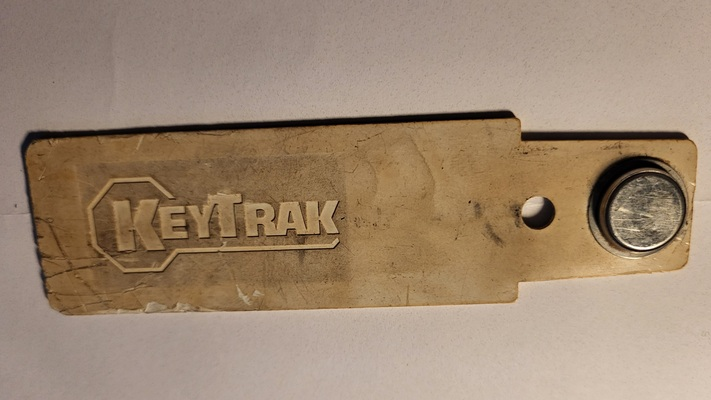
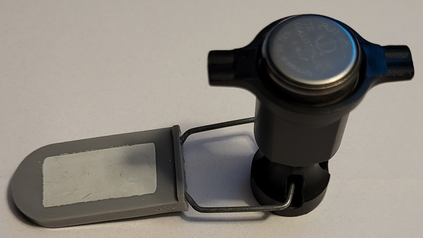
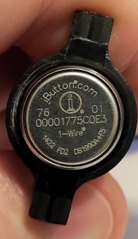

# Notes for iButton:

 - The `KeyTrac` iButton has no information engraved on it (smooth on both sides). This part of the system attaches to the car keys and goes in the drawer to track the user who removes the keys for a particular vehicle. I cut the end off which has the hole for the keyring since it was damaged. The Flipper Zero reads it perfectly.

 - The `other` iButton was given to me and I am unaware what it was actually used for. The Flipper Zero reads it perfectly as well.

 

