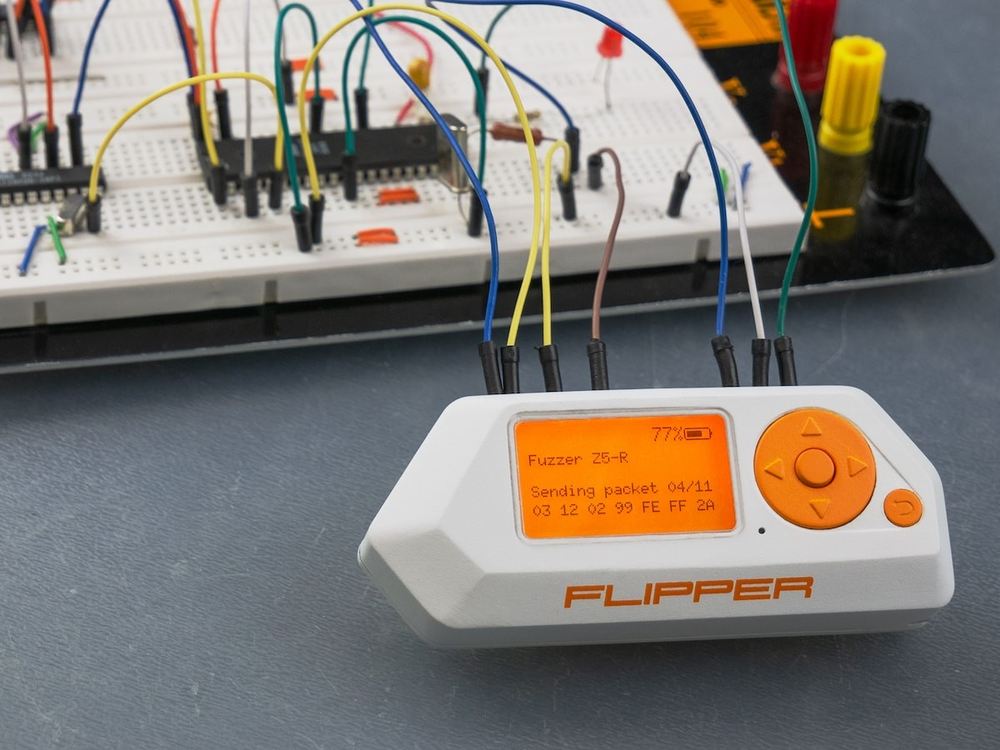

# Flipper Zero Files 3.0

Update: 5/2024:

This is a carefully curated collection of various Flipper Zero resources combined into a single repository for my own research and learning as a Computer Engineer and now AI Graduate Student.

First I installed all the relevent apps in the new official Flipper Lab [Flipper App Store](https://lab.flipper.net/apps) app store, then all the other files from the `cfwFiles` for all the extra "goodies".

If you have a Flipper Zero device, I suggest the following:
- Rule #1: Don't do anything stupid on any devices that are not YOUR OWN.
- Rule #2: Know your appropriate governing agency's laws/regulations on Wireless Spectrum alocation. Here in the US, we have the FCC part 15 which deals with 'unlicensed' spectrum. 
    - I am also a radio Amateur, so I am afforded FCC Part 97 as well. YMMV.

If none of this makes sense to you, then you probably should not own or be using a Flipper Zero device.

<div align="center">

<p> Flipper Zero GPIO Pinout </p>


<small>
    <a href="https://cdn.flipperzero.one/Flipper_Zero_GPIO_Pinout_v2.jpg">Image Source</a><br>
</small>

<br>
<p> Make Use of your Flipper's GPIO when Needed! [Not my Image] </p>



<small>
    <a href="https://thegadgetflow.com/wp-content/uploads/2021/01/Flipper-Zero-Hacking-Gadget-01-1200x900.jpg" alt="FlipperGPIO">Image Source</a><br><br>
</small>

</div>

This repo is divided into different folders:

- `cfwFiles` contains a collection of files from each of the sources listed below, but are cleaned up and organized for use with my personal Flipper Zero device. This folder has been trimmed to get rid of non-flipper device files (See Below) for minimum SD space requirements. `README.md` files have been preserved for credit along with any other file that describes functionality or ownership/contributorship.
    - The files in this folder are meant to be drop-in add-ons for my existing [Unleashed Firmware](https://github.com/DarkFlippers/unleashed-firmware/releases), so it contains all the applications and other related files for all the latest functionality.

- `myFiles` contains my personal remote codes from devices that are no longer working. This is for my 
personal research. Please use responsibly. These files are also already added to the `cfwFiles` folder.

- `fapSource` contains all the Flipper App source code file from the various repositories I listed here. Any of this code should compile into a `.fap` application. I tried to keep everything organized for future reference. This may be interesting to someone (like me) interested in Flipper Zero application development.

- `otherFiles` are any other Flipper Zero related files that are not mine, like 3D print case files, protoboard files, and things that do not need to get saved to the Flipper's SD Card.

Files not included in this repo are:
- Animations.
- Music.
- Firmware Packages.

These items are irrelevent to my work and are easily found elsewhere.

Files in this repo that I did not create myself (Nearly all of the `Build` folder) are also linked to below.

Firmware I use:
- DarkFlippers' [`Unleashed Firmware`](https://github.com/DarkFlippers/unleashed-firmware).

## Official Flipper Zero Resources:
- New official Flipper Lab [Flipper App Store](https://lab.flipper.net/apps).
- [ESP32 WiFi Marauder](https://lab.flipper.net/apps/esp32_wifi_marauder) Companion App.
    - Note that install instructions are also here: [`UberGuidoZ's Marauder Install Information`](https://github.com/UberGuidoZ/Flipper/tree/main/Wifi_DevBoard#marauder-install-information).

## Flipper Zero Device Repo File Sources:

Apps and Scripts:
- iakat's [`Awesome Flipper Zero Pack`](https://github.com/unresolv/awesome-flipperzero-pack).
- djsime's [`Awesome Flipper Zero`](https://github.com/djsime1/awesome-flipperzero).
- theisolinearchip's [`Flipper Zero Stuff`](https://github.com/theisolinearchip/flipperzero_stuff).
- Z3BRO's [`FzDumps`](https://github.com/Z3BRO/FzDumps).
- xMasterX's [`All The Plugins`](https://github.com/xMasterX/all-the-plugins).
- UberGuidoZ's [`Flipper`](https://github.com/UberGuidoZ/Flipper).
- UberGuidoZ's [`Flipper IRDB`](https://github.com/UberGuidoZ/Flipper-IRDB).
- SHUR1K-N's [`Sub GHz Jamming`](https://github.com/SHUR1K-N/Flipper-Zero-Sub-GHz-Jamming-Files).
- hak5's [`O.MG Payloads`](https://github.com/hak5/omg-payloads).
- I-Am-Jakoby's [`Flipper Zero BadUSB`](https://github.com/I-Am-Jakoby/Flipper-Zero-BadUSB).

## Flipper Zero DevBoard Sources:

- [Mini Module NRF24L01](https://www.tindie.com/products/flipper-hub/nrf24-module-for-the-flipper-zero-plug-and-play/): A Plug 'n Play NRF24 Module for FZ.
    - [nRF24L01+](https://www.sparkfun.com/datasheets/Components/SMD/nRF24L01Pluss_Preliminary_Product_Specification_v1_0.pdf) Single Chip 2.4GHz Transceiver Data Sheet.
    - Some [other documentation](https://github.com/RogueMaster/flipperzero-firmware-wPlugins/blob/420/documentation/NRF24.md) on the NRF24 Module.
- justcallmekoko's [Flipper Zero WiFi Dev Board SD Expansion](https://www.justcallmekokollc.com/product/flipper-zero-wifi-dev-board-sd-expansion/7)
- justcallmekoko's [Flipper Zero WiFi Dev Board SD-GPS Expansion](https://www.justcallmekokollc.com/product/flipper-zero-dev-board-sd-gps/3)
    - Associated Repos:
    - [`ESP32 Marauder`](https://github.com/justcallmekoko/ESP32Marauder) Repo.
    - [`Marauder Wiki`](https://github.com/justcallmekoko/ESP32Marauder/wiki/flipper-zero) : For FZ WiFi Dev Board.
- blackmagic-debug's [`Black Magic Probe`](https://github.com/blackmagic-debug/blackmagic) Debugger Repo.
- 0xchocolate's [`Flipper Zero WiFi Marauder`](https://github.com/0xchocolate/flipperzero-wifi-marauder) Companion App.
- UberGuidoZ's [`Wifi_DevBoard`](https://github.com/UberGuidoZ/Flipper/tree/main/Wifi_DevBoard#marauder-install-information) : A Repo full of useful information for the DevBoard.

## Other Flipper Resources:

- CyberSecurityUP's [`Awesome Flipper Zero 2`](https://github.com/CyberSecurityUP/awesome-flipperzero2) : A collection of useful resources.
- [TI CC1101 Data Sheet](https://www.ti.com/product/CC1101) : Used for the FZ SubGHz Transceiver module.
    - Note the frequency limitations of the CC1101 according to the datasheet:
        - 300 - 348 MHz | 387 - 464 MHz | 779 - 928 MHz.
    - The TI CC1101 supports the following modulation schemes:
        - (G)FSK | 2(G)FSK | 4(G)FSK | ASK | OOK.
- [ST STM32WB55RG Overview and Data Sheet](https://www.st.com/en/microcontrollers-microprocessors/stm32wb55rg.html) for the STM32 32-bit ARM Cortex-M4 64MHz MCU used for the Flipper Zero.
- [ST ST25R3916 Overview and Data Sheet](https://www.st.com/en/nfc/st25r3916.html) for the High performance NFC universal device and EMVCo reader used for the Flipper Zero.
- [Flipper Zero Dev Tutorial](https://github.com/m1ch3al/flipper-zero-dev-tutorial/tree/main) : How To develop apps for the Flipper Zero (GitHub & Linux based).
- [Flipper Maker](https://flippermaker.github.io/) : Generate `.sub` Flipper files for Apps.

## Under Development:
- [Flipper Zero .fap Factory](https://flipc.org/build) : A cloud-based one-click tool to build Flipper Zero .fap applications from git repositories. (used to work, currently says "under construction")

## My FZ SD Card File Structure:

- Source: [FlipperDevices Readme](https://github.com/flipperdevices/flipperzero-sd-card-examples/blob/dev/README.md)
- Modifications are mine.

```
/ext/ [FLIPPER SD (Unleashed CFW)]
│
├── apps/                           ## Put all your `.fap` files in one of these appropriate subfolders.
│   ├── Games/
│   ├── GPIO/
│   ├── Media/
│   ├── Main/
│   ├── Misc/
│   ├── NFC/
│   ├── Settings/
│   ├── Sub-GHz/
│   └── Tools/
│
├── apps_assets
│   ├── ble_spam
│   ├── crypto_dict
│   └── barcode_app
│
├── apps_data
│   ├── barcodes
│   ├── btremote_kodi
│   ├── flipper_xremote
│   └── subghz
│
├── apps_manifest
│   └── *.fim                       # each application *.fap has a manifest *.fim
│
├── badusb                          ## Put Rubber Ducky scripts here
│   └── demo_windows.txt            # Windows sample script
│
├── dolphin
│   ├── L1_Furippa1_128x64
│   │   ├── frame_x.bm              # Animation frame
│   │   └── meta.txt                # Set of rules for playing frames
│   └── manifest.txt                # Describes animation selection parameters
│
├── ibtnfuzzer
│   ├── example_uids_cyfral.txt
│   ├── example_uids_dallas.txt
│   └── example_uids_metakom.txt
│
├── iButton (1-Wire)
│   ├── Cyfral.ibtn                 # Cyfral key
│   ├── Dallas.ibtn                 # Dallas key
│   └── Metakom.ibtn                # Metakom key
│
├── infrared (IR)
│   ├── TV_bedroom.ir               # Samsung remote
│   ├── Apple_tv.ir                 # Apple tv remote
│   └── assets                      # Signal library folders
│       └── tv.ir
│
├── lfrfid (RFID)
│   ├── Em_marine.rfid              # EM4100 sample key 
│   ├── Hid_prox.rfid               # H10301 sample key EM4100
│   └── Indala.rfid                 # I40134 sample key
│
├── music_player                    ## List of tunes to play
│   ├── Arcede_Tones                # Sample tunes folder
│   └── Marble_Machine.fmf          # Sample tune
│
├── nfc
│   ├── Desfire.nfc                 # Desfire card
│   ├── Ntag_213.nfc                # Ntag_213 card
│   ├── Ntag_216.nfc                # Ntag_216 card
│   ├── Classik_1k.nfc              # Classik_1k card
│   ├── RocketBank.nfc              # Banking card
│   ├── UID.nfc                     # Card with only UID data
│   └── assets                      # NFC libraries
│       ├── aid.nfc
│       ├── country_code.nfc
│       ├── currency_code.nfc
│       └── mf_classic_dict.nfc
│
├── picopass                        ## App included w/ new CFW Firmware
│   ├── assets
│   │  └── iclass_elite_dict.txt
│   ├── iclass_decryptionkey.bin
│   └── iclass_key.bin
│
├── subghz                          ## This folder is for all SubGHz saved captures
│   ├── ****.sub                    # Captured packet
│   ├── ****_raw.sub                # Recorded raw signal
│   ├── Jamming_SubGHz              ## Sub-Folder containing scripts
│   │   ├── Jam_xxx.xx.sub          # ONLY use on your own devices!! (doesn't work good anyway, so don't get hopeful.)
│   │   └── Jam_xxx.xx.sub
│   ├── ****_raw.sub                # Recorded raw signal
│   └── assets
│       ├── dangerous_settings
│       ├── keeloq_mfcodes
│       ├── keeloq_mfcodes_user
│       ├── nice_flor_s
│       ├── last_subghz.settings
│       └── setting_user.example
│
├── subghz_remote
│   └── *.txt                       # remote file for `Sub-GHz Remote` app.
│
├── subplaylist
│   ├── Bruteforce_Gen
│   ├── CAME_12Bit_BF
│   └── Tesla
│
├── swd_scripts
│   └── *.swd
│
├── u2f
│   ├── assets
│   │   ├── cert.der                # Public certificate
│   │   └── cert_key.u2f            # Private key
│   ├── cnt.u2f # Key counter
│   └── key.u2f # Device key
│
├── unirf                           ## Place scripts for SubGHz UniRF here
│   ├── *.txt                       # example scripts for UniRF device.
│   └── **.txt
│
├── update                          ## Example Update Folders
│   ├── f7-update-0.101.2           # Example of Stable Release FW folder
│   └── f7-update-unlshd-073        # Example Of Unleashed FW Release Folder
│       ├── backup.tar              # Flipper configuration snapshot
│       ├── resources.tar 
│       ├── firmware.dfu
│       ├── radio.bin
│       ├── splash.bin
│       ├── updater.bin
│       └── update.fuf     
│
├── wav_player
│   └── example.wav                 # WAV files to play
│
├── Manifest                        # Resource files list
├── rwfiletest.bin                  # Created after running SD benchmark
└── favorites.txt                   # List of items displayed in Favorites
```

## Status:


### DISCLAIMER:

ONLY use this repo at your own risk on your own devices, and do not violate the law with any of these apps. You should only transmit on frequencies that you are authorized to do so. In the US, refer to the FCC for radio spectrum info if you are unsure of that information. This repo is FOR EDUCATIONAL USE ONLY. If you get in trouble doing something stupid, especially jamming or causing interference, then YOU are the only one to blame. I have not been able to test everything in this repo yet, since this is a work in progress, so USE AT YOUR OWN RISK.