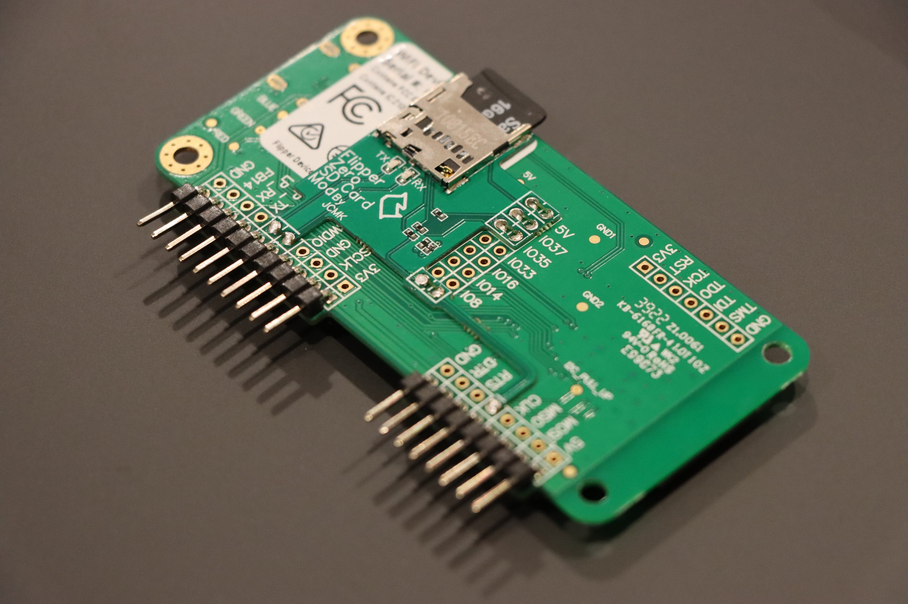
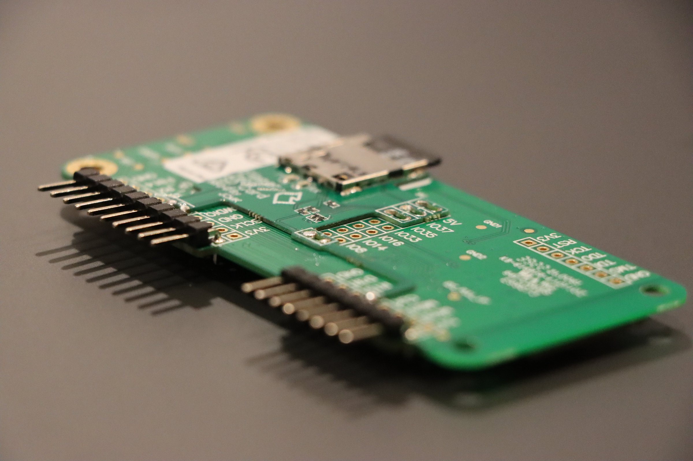
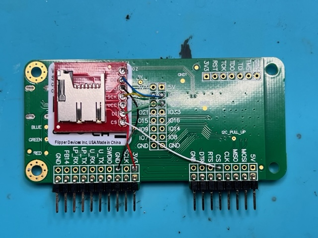

# SD Card Expansion Boards:

These are pictures of the SD card expansion card install and the applicable wiring. More photos and information about the SD and SD-GPS expansion board can be found at the links below:

- [Flipper Zero WiFi Dev Board SD Expansion](https://www.justcallmekokollc.com/product/flipper-zero-wifi-dev-board-sd-expansion/7)
- [Flipper Zero WiFi Dev Board SD-GPS Expansion](https://www.justcallmekokollc.com/product/flipper-zero-dev-board-sd-gps/3)
- [SparkFun microSD Transflash Breakout](https://www.sparkfun.com/products/544)
    - Associated Repos:
    - [`ESP32 Marauder`](https://github.com/justcallmekoko/ESP32Marauder) Repo.
    - [`Marauder Wiki`](https://github.com/justcallmekoko/ESP32Marauder/wiki/flipper-zero) : For FZ WiFi Dev Board.

 Images of SD Expansion Board install and wiring [not mine] 

 
 
 

<small>
    <a href="https://raw.githubusercontent.com/justcallmekoko/ESP32Marauder/master/pictures/IMG_5879%20-%20Copy.jpg">Images Source</a>
</small>
  

 Images of SD-GPS Expansion Board install and wiring [not mine] 

 
 
 

<small>
    <a href="https://raw.githubusercontent.com/justcallmekoko/ESP32Marauder/master/pictures/IMG_5879%20-%20Copy.jpg">Images Source</a>
</small>

