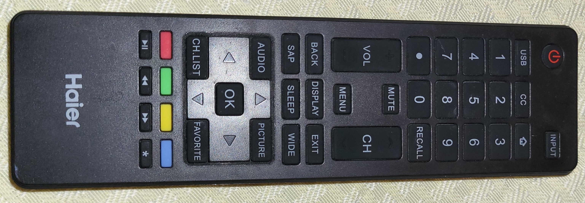
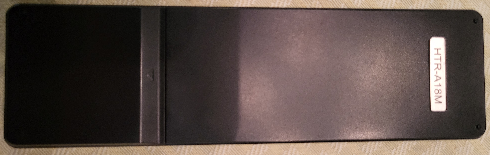

# Notes for Haier TV Remote:

The part number on the Haier Remote is: 

### $$ \text{HTR-A18M} $$

There are 2 `.ir` files for my Haier TV:

- The `Htr_a18m_1.ir` file has only the major functions of the remote.
- The `Htr_a18m_2.ir` file is a complete remote copy with all functions as listed on the remote.

## Pictures:

This is a [Haier HTR-A18M](https://www.amazon.com/HTR-A18M-LE32M600M20-LE24M600M80-LE39M600M80-LE48M600M80/dp/B07P5KPMFX/) Remote for various Haier LCD/LED TVs. 

  
 
<small>Image Sources: Both My Own</small>

