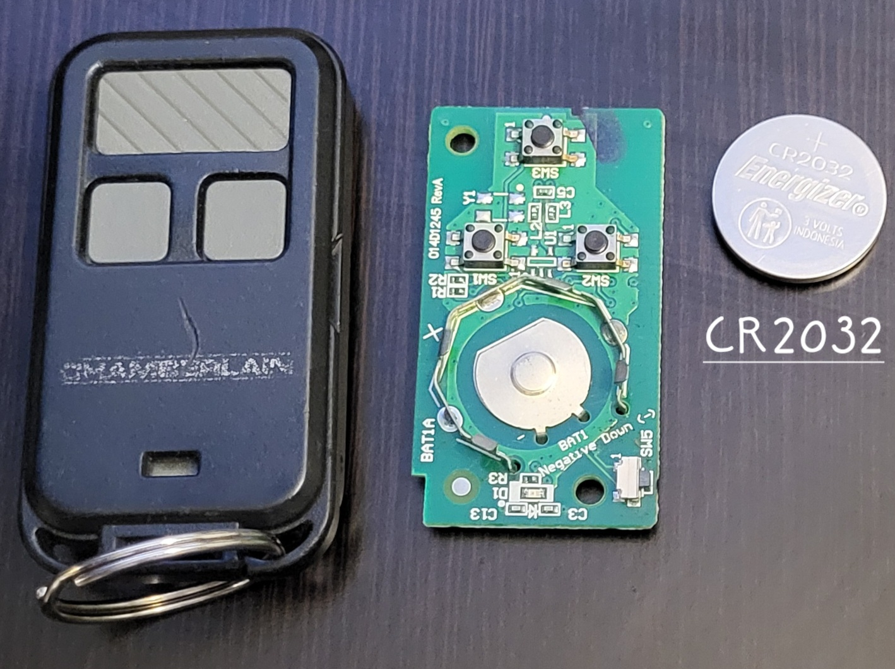
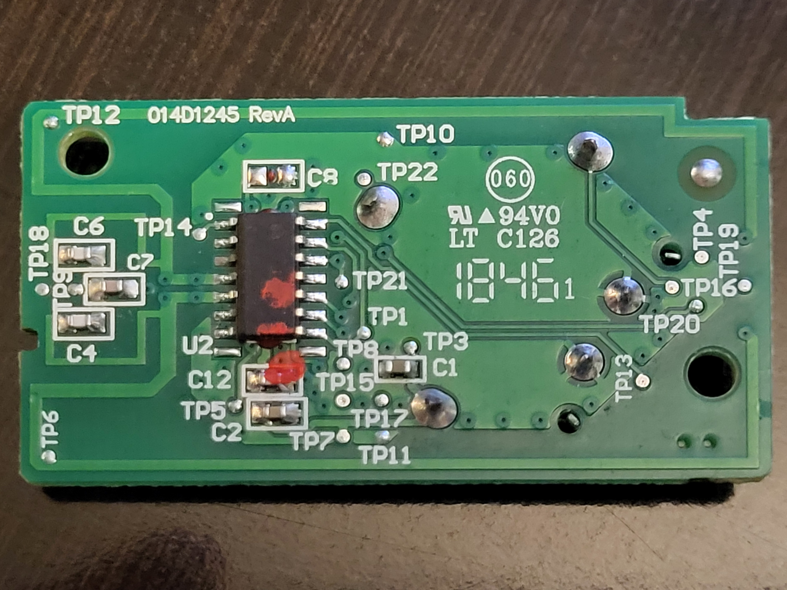

# Note For 390MHz Garage Door Opener Codes:

The `.sub` files in this folder are my own personal codes for my old (now scrapped) Craftsman (Chamberlain) 
Garage Door Opener. I had 3 separate Universal Chaimberlain Remotes, and 1 Universal Chamberlain Keypad. This 
garage opener uses the following very old and no longer secure security algorithm:

### $$ \text{390 MHz Security+ 1.0} $$

## Pictures:

This is a [Chamberlain Keychain Garage Door Remote](https://www.chamberlain.com/keychain-garage-door-remote/p/G956EV-P2MC) Part # G956EV-P2. 

  
 
<small>Image Sources: Both My Own</small>

